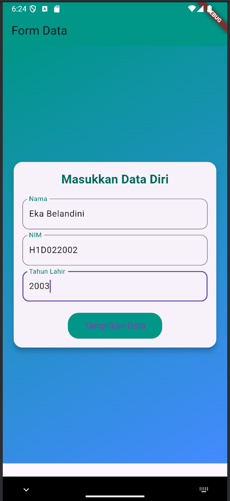
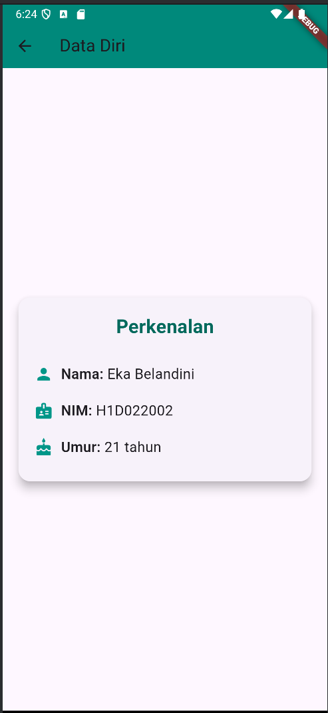

# Tugas Pertemuan 2

**Nama**  : Eka Belandini  
**NIM**   : H1D022002  
**Shift** : F


## Proses Passing Data dari Form ke Tampilan Hasil dalam Aplikasi Flutter

### 1. Form Input (File `ui/form_data.dart`)
Pada `FormData`, terdapat tiga `TextField` untuk input **Nama**, **NIM**, dan **Tahun Lahir**. Setiap input dikontrol menggunakan `TextEditingController` untuk menangani nilai yang dimasukkan.

#### a. Mengontrol Input dengan `TextEditingController`:
Digunakan untuk mengambil data dari form saat pengguna mengisi input.

```dart
final _namaController = TextEditingController();
final _nimController = TextEditingController();
final _tahunController = TextEditingController();
```

#### b. Validasi Input dan Navigasi ke Halaman Hasil:
Tombol "**Tampilkan Data**" memvalidasi apakah semua field telah diisi. Jika valid, data diteruskan ke halaman berikutnya (`TampilData`) melalui `Navigator`.

```dart
onPressed: () {
  String nama = _namaController.text;
  String nim = _nimController.text;
  int tahun = int.tryParse(_tahunController.text) ?? 0;

  if (nama.isNotEmpty && nim.isNotEmpty && tahun > 0) {
    Navigator.push(
      context,
      MaterialPageRoute(
        builder: (context) => TampilData(
          nama: nama, 
          nim: nim, 
          tahun: tahun,
        ),
      ),
    );
  } else {
    // Tampilkan pesan error
  }
}
```
>Penjelasan:
- Data dari setiap `TextField` diambil menggunakan `TextEditingController` (_namaController.text, _nimController.text, _tahunController.text).
- Jika semua field valid, `Navigator.push` digunakan untuk berpindah ke halaman hasil (`TampilData`), sambil mengirim data nama, nim, dan tahun.

## 2. Tampilan Hasil (File `ui/tampil_data.dart`)

Halaman ini menerima data yang dikirim dari form melalui konstruktor. Data ini ditampilkan di dalam widget `Card` yang rapi, dengan tambahan perhitungan umur berdasarkan tahun lahir.

### a. Menerima Data dari Halaman Sebelumnya:
Data diterima melalui parameter konstruktor di `TampilData`:

```dart
final String nama;
final String nim;
final int tahun;

TampilData({
  required this.nama,
  required this.nim,
  required this.tahun,
});
```
### b. Menampilkan Data yang Dikirim:
Data seperti **Nama**, **NIM**, dan **Umur** ditampilkan dalam bentuk teks menggunakan widget `Text`.

```dart
_buildInfoRow("Nama", nama, Icons.person);
_buildInfoRow("NIM", nim, Icons.badge);
_buildInfoRow("Umur", "$umur tahun", Icons.cake);
```
>Penjelasan:
- Nilai **nama**, **nim**, dan **tahun** dikirim dari halaman form dan diterima di sini sebagai parameter.
- Umur dihitung dengan cara `DateTime.now().year - tahun` untuk menunjukkan usia berdasarkan tahun lahir.
- Masing-masing nilai ditampilkan dalam layout yang rapi dengan ikon yang sesuai (misalnya, ikon `person` untuk Nama, `badge` untuk NIM, dll.).

### 3. Navigasi Antar Halaman

Proses utama untuk berpindah dari halaman form ke halaman hasil adalah menggunakan `Navigator.push`. Ini memungkinkan aplikasi untuk berpindah antar halaman dan mengirim data.

**Proses Navigasi:**

```dart
Navigator.push(
  context,
  MaterialPageRoute(
    builder: (context) => TampilData(
      nama: nama,
      nim: nim,
      tahun: tahun,
    ),
  ),
);
```

>Penjelasan: 
- `Navigator.push` digunakan untuk berpindah halaman.
- Data dari form dikirim melalui konstruktor `TampilData`.


## Screenshot
Berikut merupakan contoh program:

     

